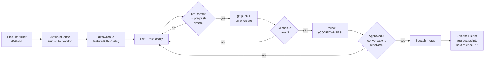

# Contributing to fleet-operations

Thanks for taking the time to contribute. This page is the quick reference for how to land a change. The longer narrative lives in [`docs/onboarding.md`](docs/onboarding.md) and [`docs/gitflow.md`](docs/gitflow.md) — read those first if this is your first PR here.

## The contribution loop



## Before you start

- A Jira ticket exists in [project KAN](https://maksymleb18.atlassian.net/jira/software/projects/KAN/boards). Take it to *In Progress* and self-assign.
- You've read the spec section relevant to the work (`docs/requirements/fleet_operations_spec.md`).
- For UI changes, you've eyeballed the relevant screen in `docs/requirements/fleet_mockup.html`.

## Code style

We enforce style through tooling, not policy debate. Run the formatter; the formatter wins.

- **TypeScript** — Prettier (formatter) + ESLint (linter). See [`docs/conventions/typescript.md`](docs/conventions/typescript.md) for the project-specific patterns.
- **CSS Modules** — colocate `Component.module.css` next to `Component.tsx`. No global classes.
- **No `any`** in production code. Use `unknown` and narrow.
- **Strict TypeScript** is on in both modules. `tsconfig.json` extends a shared base; don't loosen flags without a Tech Lead review.

Both modules expose the same npm script names: `lint`, `lint:fix`, `format`, `format:check`, `typecheck`, `test`, `build`. CI runs all of them; the pre-push hook runs `lint` + `typecheck` so your push is unlikely to fail in CI for a fixable reason.

## Branching & commits

- Branch name: `feature/KAN-{N}-{slug}` (lowercase-hyphen, ≤5 words).
- Commit subject: `<type>: KAN-{N} <imperative summary>` using Conventional Commits. Allowed types: `feat`, `fix`, `chore`, `docs`, `refactor`, `test`, `perf`, `build`, `ci`, `style`, `revert`. The local `commit-msg` hook rejects anything else.
- One logical change per commit when feasible. Squash-merge collapses to one commit anyway, but tidy history makes reviews easier.

The full convention with examples is in [`docs/gitflow.md`](docs/gitflow.md).

## Testing

Every change comes with the appropriate tests; reviewers will ask if you skip them.

- **Unit / integration**: in the module's `tests/` directory next to the code under test.
- **End-to-end**: in `src/frontend/tests/e2e/` (Playwright). Reach for these for any flow that crosses the API ↔ UI boundary.
- **Coverage**: ≥ 80% on changed files. CI reports per-PR coverage delta.

Run locally:

```sh
( cd src/backend  && npm test )
( cd src/frontend && npm test )
( cd src/frontend && npm run test:e2e )   # boots the app, takes ~30 s
```

## Pull request checklist

Use the PR template — it auto-loads when you run `gh pr create`. The four sections are non-negotiable:

- **Summary** — one paragraph. Why this change exists.
- **Changes** — bullet list. What changed at a structural level.
- **Test Plan** — the commands or scenarios that verified the change locally.
- **Linked Ticket** — `Closes: KAN-{N}` so Jira's GitHub integration transitions the ticket on merge.

The CI checks that must pass before merge:

- `lint`, `typecheck`, `test`, `build` (per module that exists)
- `secret-scan` (gitleaks against the diff and history)
- `pr-title-check` (regex match against the Conventional-Commits-with-`KAN-N` pattern)

Additionally:

- All review conversations resolved.
- At least one CODEOWNERS approval (auto-assigned; see `.github/CODEOWNERS`).
- Linear history maintained (`git pull --rebase origin main` before opening the PR; rebase + force-push on the feature branch if `main` moved).

The `ai-pr-review` workflow runs in advisory mode — its red X never blocks merge, but reviewers will look at what it surfaced.

## What gets a release

Release Please reads commit types on `main` and aggregates them into an open release PR:

- `feat:` → bumps minor (or patch while pre-1.0)
- `fix:` → bumps patch
- `feat!:`, `fix!:`, or `BREAKING CHANGE:` footer → bumps major (or minor while pre-1.0)
- `chore`, `docs`, `refactor`, `test`, `build`, `ci`, `style` → no version bump

When the release PR is merged, a tag and a GitHub release are produced; the `deploy-production` workflow waits for an Admin's manual approval before it fires.

## CI behaviour on early PRs

The first few PRs after `/configure` may land before `src/backend/` or `src/frontend/` actually exist (the modules are scaffolded by `/new-release`). The CI workflow detects this and prints `No module sources found yet — skipping job.` for `lint` / `typecheck` / `test` / `build`. That's intentional — don't read the empty results as broken. The `secret-scan` and `pr-title-check` jobs still run on every PR.

## AI assistance

Everything in `ai-instructions/` is the AI pack. Slash commands (`/configure`, `/new-release`, `/edit-release`, `/finish-release`, etc.) operate on this repo. You don't need to read the pack to contribute code; you do need to follow what it produces (CI rules, branch protection, PR template). If something in the AI-generated docs looks wrong, open a Discussion or a PR — those docs are version-controlled too.

## Where to ask

For questions, open a [GitHub Discussion](https://github.com/sidious18/ai-template-reference/discussions) tagged `contributing`. For security concerns, follow [`SECURITY.md`](SECURITY.md).
