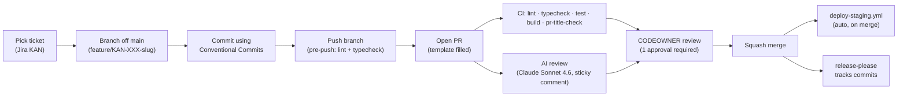

# Contributing

Thanks for your interest in contributing to fleet operations. This document covers the contributor flow — what we expect in a PR, how reviews work, and the etiquette we hold ourselves and contributors to. New team members should also read [`docs/onboarding.md`](docs/onboarding.md), which covers the first-day environment setup and the gitflow walk-through.

## Before you start

- Read [`docs/project-summary.md`](docs/project-summary.md) so you know what the product does and what's in scope for v1 (vs. what's deliberately out-of-scope per `§7` of the spec).
- Pick a ticket from [Jira KAN](https://maksymleb18.atlassian.net/browse/KAN) — Todo column, unclaimed. Assign yourself and move it to **In Progress**.
- If you don't have a ticket but want to fix something you noticed, open an issue first using the appropriate form (`bug`, `feature`, `task`, `chore`) and ask for a Jira ticket to track it. Every change in this repo carries a `KAN-\d+`.
- Drive-by typo / docs fixes are welcome and can use a `chore` ticket grabbed from the backlog.

## Contributor flow

## What we expect in a PR

**Scope.** One ticket, one PR. If you find another issue while working, file a ticket and a separate PR; don't fold it in. Reviewers spend less time on a focused 200-line change than on a sprawling 2,000-line one.

**Convention.** Commit messages and the PR title both follow [Conventional Commits](https://www.conventionalcommits.org/) with a `KAN-\d+` in the subject:

    feat(dashboard): KAN-42 add empty-state CTA and starter templates

The `pr-title-check` GitHub Action enforces this regex. Release Please's auto-generated `chore: release X.Y.Z` PRs are the only allowed exception.

**Tests.** New features ship with tests. Bug fixes ship with a regression test that fails before your fix. The CI matrix runs Vitest in both workspaces and Playwright e2e against the running SPA. The pre-commit hook formats + lints staged files; the pre-push hook runs the full lint + typecheck — match the CI gate.

**PR body.** The template asks for four sections — fill all four:

- **Summary** — one paragraph: what changes and why.
- **Changes** — bullets per module touched. Don't paste the diff; describe behavior.
- **Test Plan** — what you ran locally, what manual verification you did, the CI jobs you watched. Include before/after screenshots for UI changes.
- **Linked Ticket** — `Closes KAN-XXX` so Jira's GitHub integration auto-links and the ticket transitions to Done on merge.

**Accessibility.** UI changes must keep WCAG 2.1 AA — color contrast, keyboard nav, focus rings. Color is never the only signal (severity dots, anomaly markers, correlation cells all carry text or shape redundancy — `§6.2`).

**Security.** Anything touching auth, the SQL console, the audit log, PII export, or the rate-limit / cost-ceiling code paths gets extra scrutiny. Flag in the PR description if you're in that area. Privately reportable vulnerabilities should go through [SECURITY.md](SECURITY.md), not a public PR.

## What reviewers look for

[`docs/code-review.md`](docs/code-review.md) has the full checklist. Highlights:

- Correctness — does the change do what the ticket asks?
- Workspace isolation — every query / job scoped to a workspace id.
- Strict TypeScript — no `any`, no unsafe casts. `noUncheckedIndexedAccess` is on.
- Tests — present and meaningful, not just present.
- Naming — lowercase-hyphen file and directory names; no `Utils.ts` or `helpers/`. Names describe the domain (`driver-scoring`, `cohort-grid`), not the layer.
- Diff size — flag changes > 800 lines unless they're mechanical (codegen, mass rename).

The AI reviewer (Claude Sonnet 4.6 via Bedrock) posts a sticky comment with findings grouped by Correctness / Security / Performance / Maintainability. **Treat it as advisory** — it's not a required check and a model outage should never block merges. But read the findings and address legitimate ones before requesting CODEOWNER review.

## Code conventions

The full per-language conventions live in [`docs/conventions/`](docs/conventions/). The repo currently has TypeScript only:

- [`docs/conventions/typescript.md`](docs/conventions/typescript.md) — formatter (Prettier), linter (ESLint), type rules, idiomatic patterns, anti-patterns, the PR checklist for TS files.

When `/new-release` adds an `iac` or other module later, the per-language conventions docs get added at the same time. They're the source of truth — refer to them, don't argue style in PR comments.

## Outside contributors

This is currently a single-team repo. If you're an outside contributor:

1. Open an issue first describing what you'd like to do. The Tech Lead (`sidious18`) will respond within a few days with either "yes please, here's a ticket" or context on why it's not aligned with v1 scope.
2. Fork the repo. Branch from `main` using `feature/KAN-XXX-slug` once a ticket exists. We'll get a Jira ticket created and shared with you.
3. Sign off your commits if your employer requires it: `git commit -s …`.

We don't currently have a CLA — by opening a PR you're agreeing to license your contribution under the same [MIT License](LICENSE) as the rest of the repo.

## Etiquette

- **Be specific in PR comments.** "This is wrong" is not a review; "this loops over all workspaces on every request — should it be scoped?" is.
- **Code review is conversation, not adjudication.** If the author pushes back, engage with the reasoning. If you're the author, the goal is the best change, not the change you opened with.
- **Resolve your own conversations** when you've addressed them; leave open the ones you want the reviewer to weigh in on. Branch protection requires all conversations resolved before merge.
- **Stale reviews are dismissed** when new commits land. After a substantive push, ping reviewers again.
- **Don't merge your own PR** unless explicitly asked. The merge button is for the reviewer — that's how we keep the "two pairs of eyes" guarantee.
- **Don't `--no-verify` push** unless you have a documented reason. The hooks exist to catch what CI catches, faster.

## What happens after merge

- The squash commit lands on `main`.
- `deploy-staging.yml` fires automatically and pushes to the staging environment within a few minutes.
- `release-please` tracks the commit. When enough unreleased changes accumulate (or you ask it to manually), it opens a release PR titled `chore: release X.Y.Z`. Merging that PR cuts a tag, writes the CHANGELOG, and triggers `deploy-production.yml` (which has a manual approval gate via the `environment: production` rule).
- The Jira ticket transitions to **Done** via the `Closes KAN-XXX` line in the PR body.

## Questions

Open an issue tagged `question` on [sidious18/ai-template-reference](https://github.com/sidious18/ai-template-reference/issues) or start a thread in [Discussions](https://github.com/sidious18/ai-template-reference/discussions). For security issues, follow [SECURITY.md](SECURITY.md) instead.
