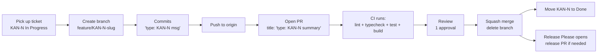

# Gitflow

Fleet operations follows **trunk-based development**: `main` is always shippable, every change lands as a short-lived feature branch, and merges happen via squash to keep history linear.

## Branching model

- **`main`** — the trunk. Always shippable, always passes CI. Protected.
- **`feature/KAN-{NUMBER}-{slug}`** — short-lived branches off `main` for new work. Slug is lowercase-hyphen, derived from the ticket title. Live for hours-to-days, never weeks.
- **`fix/KAN-{NUMBER}-{slug}`** — bug fixes. Same lifecycle as feature.
- **`chore/KAN-{NUMBER}-{slug}`** — config, deps, refactors that aren't user-visible. Same lifecycle.
- **`release-please--*`** — auto-generated by Release Please (added once `/tmpl-bootstrap` Full scope or a later `/tmpl-reconfigure` enables release automation). Do not push directly.

## Branch name examples

```
feature/KAN-42-add-login-screen
fix/KAN-87-resolve-dashboard-flicker
chore/KAN-105-bump-svelte-to-5
```

## Commit message format

Conventional Commits + Jira ticket ID in the subject. The `commit-msg` Husky hook enforces this.

```
<type>: KAN-<number> <imperative summary in lower case>

<optional body — what and why, not how>

<optional footer — Closes: KAN-42 / Refs: KAN-43>
```

Types: `feat`, `fix`, `chore`, `docs`, `refactor`, `test`, `perf`, `ci`, `build`, `style`, `revert`.

Example:

```
feat: KAN-42 add SSO sign-in mode

Adds the SSO tab to the auth screen with workspace-slug entry and a
recent-organizations list. Validates slug format (3-32 chars,
lowercase ASCII + hyphens) on submit.

Closes: KAN-42
```

## Pull request lifecycle

1. **Pick up a ticket** in Jira (KAN project). Move it to *In Progress*.
2. **Create the branch** off `main`:
   ```
   git switch main && git pull
   git switch -c feature/KAN-42-add-login-screen
   ```
3. **Commit early, commit often.** Each commit's subject must reference `KAN-{N}` — the hook rejects otherwise.
4. **Push** when ready. Pre-push runs `lint` and `typecheck` locally; CI runs the full matrix on the PR.
5. **Open the PR** with title `feat: KAN-42 add login screen` (same shape as the commit). PR description fills the four sections: Summary, Changes, Test Plan, Linked Ticket.
6. **Review** — one approval required (CODEOWNERS will be wired up once `.github/CODEOWNERS` is generated in Full scope).
7. **Merge** — **squash**. The squash commit's title and body should be edited to a single clean Conventional Commit line — GitHub defaults concatenate every commit, which is noise.
8. **Delete the branch** after merge. Move the Jira ticket to *Done*.

## Merge rules

- **Squash, always.** Keeps `main`'s history one commit per ticket, which makes `git log --oneline` legible and makes Release Please's auto-generated changelogs clean.
- **No merge commits, no rebase-and-merge.** Disabled at the repo level once branch protection is applied.
- **Linear history required** — `main` is rebased forward, never merged backward.

## Branch lifecycle diagram



## Common workflows

**Pulling fresh changes onto a feature branch** (don't merge, rebase):

```
git switch feature/KAN-42-...
git fetch origin
git rebase origin/main
git push --force-with-lease
```

**Stashing in-progress work to switch branches:**

```
git stash push -m "wip: dashboard cell selection"
git switch feature/KAN-87-...
# ... do other work ...
git switch -
git stash pop
```

**Recovering a deleted branch** (within ~30 days):

```
git reflog | grep KAN-42
git switch -c feature/KAN-42-...  <commit-sha>
```

## What CI checks (once /tmpl-bootstrap Full or a /tmpl-reconfigure adds workflows)

| Check | What it does |
|---|---|
| `lint` | ESLint across `src/backend` and `src/frontend` |
| `typecheck` | TypeScript strict mode, both modules |
| `test` | Vitest unit tests, Playwright e2e |
| `build` | Production builds for backend and frontend |
| `pr-title-check` | PR title must match `^(feat\|fix\|chore\|docs\|refactor\|test\|perf): KAN-\d+ .+` |
| `secret-scan` | gitleaks on the PR diff |

Core scope does not generate these workflows yet — bump to full via `/tmpl-reconfigure "bump to full scope"` when you want them.
