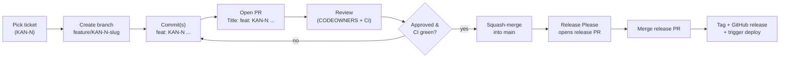

# Gitflow

This project uses a **trunk-based** workflow. Short-lived feature branches off `main`, squash merges back to `main`, no long-running release branches. Release Please turns conventional-commit history into release PRs and tags.

## Branches at a glance



Only `main` is protected. There are no `develop`, `release/*`, or `hotfix/*` branches — hotfixes are normal `fix:` commits that land on `main`.

## Branch naming

Pattern: `feature/{TICKET}-{slug}` where `{TICKET}` is the Jira key in **`KAN-NNN`** form and `{slug}` is a lowercase-hyphen summary (≤ 5 words).

Examples:

```sh
git switch -c feature/KAN-123-sql-console-sandbox-guard
git switch -c feature/KAN-204-driver-scoring-weights-export
git switch -c feature/KAN-318-fix-rate-limit-bypass
```

The prefix `feature/` is the same for everything (features, fixes, chores). The commit message — not the branch name — is what gets categorized by Conventional Commits and Release Please.

If the work is **not** tied to a Jira ticket (rare; almost everything should be), create the ticket first. Release-bot commits are the one exception, and Release Please opens its own branch.

## Commit messages

Conventional Commits, with the **Jira key inline at the start of the subject**. The local `commit-msg` hook (see `.pre-commit-config.yaml`) and the `pr-title-check` workflow both enforce the same pattern.

```
<type>[(scope)][!]: KAN-NNN <imperative present-tense summary>

[body — paragraphs explaining the WHY when not obvious]

[footers — Closes: KAN-NNN, BREAKING CHANGE: …]
```

Allowed types: `feat`, `fix`, `chore`, `docs`, `refactor`, `test`, `perf`, `build`, `ci`, `style`, `revert`. Anything else is rejected.

Examples:

```
feat: KAN-123 add SQL console sandbox-mode guard

The default for new workspaces is sandbox. Promotion to
production data requires an admin action and is irreversible —
matches design decision 8.4 of the spec.
```

```
fix(auth): KAN-318 rate-limit failed sign-ins per IP

Returns 429 after 5 failed attempts in a 5-minute window.
Closes: KAN-318
```

```
chore: release 1.4.0
```

The last one is **only** for Release Please — that's its auto-generated PR title and is accepted by `pr-title-check` without a Jira key.

## Pull requests

1. **Open the PR** from your `feature/KAN-N-slug` branch into `main`. The title must match the `pr-title-check` regex (same shape as the commit message). The PR template auto-loads — fill in **Summary**, **Changes**, **Test Plan**, and **Linked Ticket** (the `KAN-NNN` URL).
2. **CI fires** — `lint`, `typecheck`, `test`, `build`, `secret-scan`, `pr-title-check`, and (advisory) `ai-pr-review`. Address every failure before requesting human review.
3. **Reviewers** are auto-assigned via CODEOWNERS (see `.github/CODEOWNERS`). You need **at least one** approval, and every review conversation must be resolved before merging.
4. **Merge strategy**: **squash**. The squash commit message inherits the PR title — keep it tidy because Release Please reads it. Delete the branch after merging.

## Merge rules

- **Squash and merge** is the only allowed merge type. Rebase / merge-commit are disabled at the repo level.
- **Linear history** is required on `main`. If your branch falls behind, rebase locally (`git pull --rebase origin main`) and force-push to your feature branch (forced pushes to `main` are blocked).
- **Conversations must be resolved** before the Merge button enables.
- **AI PR review** runs as advisory feedback — its red X never blocks merge. CODEOWNERS, CI, and conversation resolution do.

## Picking up a Jira ticket

1. Pick a ticket in [Jira project KAN](https://maksymleb18.atlassian.net/jira/software/projects/KAN/boards). Move it to *In Progress* and self-assign.
2. Branch from `main`:

   ```sh
   git switch main && git pull --rebase origin main
   git switch -c feature/KAN-{N}-{slug}
   ```

3. Commit using the convention above. The local `commit-msg` hook rejects messages without `KAN-N`.
4. Push and open a PR. Add `Closes: KAN-{N}` in the PR body so Jira's GitHub integration auto-links and transitions the ticket on merge.

## Releases

Release Please watches `main`. After your squash-merge, it updates an open *release PR* with your `feat:` / `fix:` / `perf:` commits aggregated into `CHANGELOG.md`. When the team is ready, an Admin reviews and merges that release PR — that produces a tag, a GitHub release, and (when configured) triggers the `deploy-production` workflow.

Commits typed `chore`, `docs`, `refactor`, `test`, `build`, `ci`, `style` do **not** cause a release on their own — they ride along in the next release PR.

## When you really need to bypass

The local hooks rarely need bypassing. If you genuinely need to:

- Skipping `pre-commit` for a single commit: `git commit --no-verify` — discouraged, leaves no audit trail.
- The CI guardrails on `main` are not bypassable by anyone except Admins, and Admins should pair on any direct push.

If you find yourself reaching for `--no-verify`, that's a smell — usually the underlying issue is fixable.
