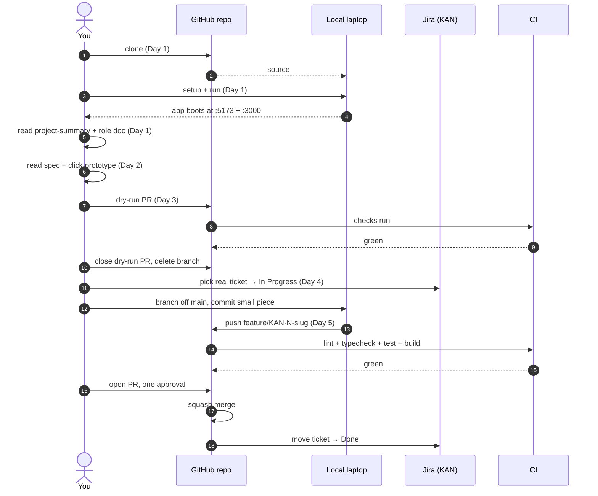

# Welcome to Fleet Operations

Fleet Operations is a web application that gives logistics and operations teams a single workspace to monitor day-to-day fleet activity, analyze trip / fuel / driver / incident data, and generate scheduled reports. The people who'll use what you ship are fleet managers, operations directors, data analysts, and HR/safety officers — they live inside two screens: a configurable 8×8 dashboard grid and a research workspace with eleven analytics tools. By the end of this page you'll have the project running locally, walked an end-to-end PR as a dry run, and seen where to look when something goes wrong.

## What you're walking into

You're joining a small cross-functional team: a Tech Lead, Backend and Frontend Developers, a DB Architect, a Data Scientist, a UI/UX Designer, and a QA Engineer. Each role has its own study list under [`docs/roles/`](roles/) — read the one for your role on day two; this page is the shared starting point everyone reads first.

The codebase is two independent TypeScript modules:

- **backend** (server, TypeScript) at [`src/backend/`](../src/backend/) — Node.js + Express against PostgreSQL (auth, schedules, users, audit log) and ClickHouse (trips, fuel, anomaly detection). Redis sits in front of the widget cache and behind the scheduled-exports queue.
- **frontend** (client, TypeScript) at [`src/frontend/`](../src/frontend/) — SvelteKit + Tailwind. The dashboard's grid composer and the research-workspace tools live here.

Both modules have their own `package.json` and their own `tests/` folder; you can boot one without the other.

The integrations wired into this repo: tickets land in **Jira** (project [`KAN`](https://maksymleb18.atlassian.net/jira/software/projects/KAN) — "My Kanban Project"); product docs live in **Confluence** (space `SD` — "Software Development"), with the Project Overview / Requirements / Technologies / User Roles pages created during `/tmpl-setup`; code review and CI run on **GitHub** ([`sidious18/ai-template-reference`](https://github.com/sidious18/ai-template-reference)).

## Interactive prototype

The product was specified with a clickable HTML prototype. Open it in your browser to walk every screen before touching any code:

- [`docs/requirements/fleet_mockup.html`](requirements/fleet_mockup.html) — Fleet Operations interactive mockup. Open in a browser to interact with the live HTML rendering. (Inline screen previews aren't rendered yet — Playwright + Chromium hasn't been installed. Run `npx playwright install chromium` and re-run `/tmpl-setup` if you want a Screens table here.)

The full written specification sits alongside it at [`docs/requirements/fleet_operations_spec.md`](requirements/fleet_operations_spec.md). Skim the prototype first; reach for the spec when you need the exact wording of a constraint.

## Your first day (≈ 30–60 min)

1. **Clone the repo.** `git clone git@github.com:sidious18/ai-template-reference.git` — about 30 seconds over a normal connection.
2. **Run setup.** A `setup.sh` will exist after the first `/tmpl-release-new` runs. Until then, the manual setup is: `cd src/backend && npm install` and `cd src/frontend && npm install`. Each takes a minute or two on a warm cache; the first run pulls Vite, SvelteKit, Tailwind, Express, and the test runners. Look for "added N packages" with no `npm ERR!` lines.
3. **Run the app.** Same story for `run.sh` — it'll appear with the first release. For now, start the backend with `npm --prefix src/backend run dev` (it listens on `http://localhost:3000` by default) and the frontend with `npm --prefix src/frontend run dev` (Vite at `http://localhost:5173`). Open `http://localhost:5173` in your browser; you should see the auth screen — sign in, create account, SSO tab — matching the prototype at `docs/requirements/fleet_mockup.html`.
4. **Open the codebase.** Glance at the two modules listed in *What you're walking into*. Don't try to read everything — find the entry point for your role (your role doc points at it).

If the manual commands above fail because the module folders don't exist yet, that's expected on a freshly-configured repo. `/tmpl-release-new` is what scaffolds them — the Tech Lead's review of the configure PR is the gate that runs first.

## Your first week

> **Day 1.** Today is about environment and product. Finish the steps in *Your first day* above, then read [`docs/project-summary.md`](project-summary.md) end to end and the role doc that matches what you'll be doing ([`docs/roles/{your-role}.md`](roles/)). Don't write code yet; the goal is to know the lay of the land.

> **Day 2.** Read the spec at [`docs/requirements/fleet_operations_spec.md`](requirements/fleet_operations_spec.md) with the HTML prototype open in another tab. Pay attention to the constraints in the *Key Constraints* section of `project-summary.md` — performance budgets and the SQL-console safeguards are non-negotiable. Click around the prototype; it answers most "how should this behave" questions faster than the spec.

> **Day 3.** Walk a dry-run PR end to end as described in *Your first PR (a dry run)* below — branch, commit, push, open the PR, get a thumbs-up from your reviewer, close without merging. You'll touch the commit hook, the pre-push checks, the PR title check, and the review template in one sitting.

> **Day 4.** Pick up a real ticket from the KAN backlog (your tech lead can point at a starter one). Follow *How to start a real ticket* below. You're not expected to finish it today; the goal is to start with a clean branch and a clear `In Progress` ticket.

> **Day 5.** Continue the ticket. Ship a small piece of it — even a test or a tightened type — through review. Read your role doc's *Recommended reading* list with the parts of the codebase you've now touched in mind; it'll mean more than it did on Monday.

By the end of week one, you'll have:

- The project running locally end-to-end against the same stack as production.
- Walked the gitflow once on a dry-run PR and once on a real ticket.
- Read `project-summary.md`, the full spec, your role doc, and `gitflow.md` — and you'll know which to reach for first when a question comes up.
- A clear picture of what *your* module looks like and which CI checks are most likely to bite you on review.

## Your first PR (a dry run)

The point of the dry run is to feel the workflow before doing real work — open a PR, walk it through review, then close without merging. Use any small no-op change (a typo fix in a doc, a comment tweak) so review is fast.

1. **Pick a Jira ticket** for the dry run — or create one. Use a starter ticket like `KAN-1` if your team has reserved one for onboarding; otherwise create a `chore` ticket titled "Onboarding dry-run PR".
2. **Branch off `main`:**
   ```
   git switch main && git pull
   git switch -c chore/KAN-1-onboarding-dry-run
   ```
3. **Make a tiny edit and commit.** The `commit-msg` Husky hook will reject any subject that doesn't match `<type>: KAN-<n> <summary>`. A passing message:
   ```
   chore: KAN-1 fix typo in onboarding doc
   ```
4. **Push.** `git push -u origin chore/KAN-1-onboarding-dry-run`. The `pre-push` hook runs `lint` and `typecheck` first; if either trips, fix and re-push.
5. **Open the PR.** Title must match the same conventional-commit + ticket shape — for example, `chore: KAN-1 fix typo in onboarding doc`. The `pr-title-check` workflow (added once you bump to full scope or run `/tmpl-reconfigure`) rejects anything else. Fill the four sections of the PR template:
   - **Summary** — one sentence on what changed and why.
   - **Changes** — the file(s) you touched.
   - **Test Plan** — "manual review only — dry run."
   - **Linked Ticket** — `KAN-1`.
6. **Get one approval**, then **close without merging**. Delete the branch. Move `KAN-1` back to *Backlog* (or *Done* with a "dry run" comment) so the next new hire can reuse it.

The squash button is real — when you do this for a real ticket on Day 4, you press *Squash and merge* and edit the resulting commit message to a single clean line.

## How to start a real ticket

1. **Pick a ticket** in [Jira project `KAN`](https://maksymleb18.atlassian.net/jira/software/projects/KAN). Move it to *In Progress*.
2. **Branch from `main`** with the configured pattern — `feature/KAN-{number}-{slug}` for new work, `fix/KAN-{number}-{slug}` for bug fixes, `chore/KAN-{number}-{slug}` for non-user-visible changes. The slug is lowercase-hyphen, derived from the ticket title (`KAN-42: Add login screen` → `add-login-screen`).
3. **Commit with the conventional-commit + ticket-ID format.** The Husky hook enforces it locally; the `pr-title-check` workflow enforces the matching shape on the PR title.
4. **Open the PR** and fill the four template sections. Self-assign reviewers based on which module(s) you touched — once `.github/CODEOWNERS` is generated (full scope), the assignment is automatic.
5. **Squash-merge** on green CI and one approval. Delete the branch. Move the ticket to *Done*.

The full ceremony is in [`docs/gitflow.md`](gitflow.md). It's short — read it.

## Local test commands

- **backend** — `npm --prefix src/backend test` (Vitest unit suite). Add `-- --coverage` for the coverage report.
- **frontend** — `npm --prefix src/frontend test` (Vitest unit) and `npm --prefix src/frontend run test:e2e` (Playwright).
- **Everything at once** — `npm test` from the repo root once the root `package.json` has a `test` script wired up (it doesn't yet — the first `/tmpl-release-new` adds it).

The pre-push hook runs `lint` and `typecheck` against changed files only; the full test matrix runs in CI.

## What's in this repo

A short tour of the layout so the AI-pack files don't look intimidating:

| Path | What it is |
|---|---|
| `src/backend/`, `src/frontend/` | The two product modules. All application code lives here — nothing else is application code. |
| `docs/project-summary.md` | The product idea, target users, requirements shape, stack, constraints. The single page to send to a stakeholder. |
| `docs/onboarding.md` | This file. |
| `docs/gitflow.md` | Branches, commits, PR lifecycle. The rules the hooks and CI enforce. |
| `docs/conventions/` | Per-language conventions (TypeScript first). What's clean code on this project. |
| `docs/roles/` | One file per team role — what *your* role looks like on *this* project. Read yours on day two. |
| `docs/requirements/` | The source specification + the interactive HTML prototype. |
| `docs/images/` | UI screenshots / wireframes / mockups (`docs/images/ui/`) and architecture diagrams (`docs/images/architecture/`) when they get added. |
| `README.md` | Public-facing entry point. Mostly pointers into `docs/`. |
| `ai-instructions/configure.json` | The decision record produced by `/tmpl-setup`. Stack, gitflow, roles, integrations — every up-front decision is here. |
| `ai-instructions/releases/init/` | Initial release artifacts (the seed `project-summary.md`). Later releases land alongside. |
| `ai-instructions/` (everything else) | AI guides, role descriptors, and command definitions. You **don't** need to read these to do your job — they're for the AI assistant. |
| `CLAUDE.template.md`, `AI_INSTRUCTIONS.md`, `AGENTS.md` | Templates the bootstrap step uses. Safe to ignore unless you're maintaining the AI pack. |
| `.husky/`, `.commitlintrc.json`, `.lintstagedrc.json`, `.gitleaks.toml`, `.editorconfig`, `.gitattributes`, `.gitignore` | Local enforcement: commit-message lint, staged-file lint, secret scan, line endings, whitespace. The hooks make sure a broken commit doesn't reach review. |

## Glossary

The fleet-operations domain has a small but specific vocabulary. The spec uses these terms exactly:

> **Workspace** — a single customer organization's tenant. The product is multi-workspace; data does not cross workspaces, and the SQL console blocks cross-workspace queries at the API layer.
>
> **Dashboard** — the 8×8 grid (64 cells) where a user composes their own view by selecting rectangular regions and assigning a widget. Three states: empty, selecting, configured. Layouts are saved per-user-per-workspace, with named layouts switchable.
>
> **Widget** — one of nine v1 catalog entries (KPI tile, trend line, bar comparison, leaderboard, issues feed, utilization heatmap, …) placed into a dashboard region. The catalog is fixed in v1 — custom widgets are out of scope.
>
> **Research workspace** — the second main screen. Hosts eleven analytics tools split into Explore (query builder, pivot, cohorts, SQL console), Analyse (trend & forecast, anomaly detection, driver scoring, correlation matrix), and Deliver (report builder, scheduled exports, saved views).
>
> **Saved view** — a parameterised analytics configuration the user can re-open or promote to a dashboard widget. Promotion is explicit (a button), not automatic.
>
> **Trip** — one continuous journey of one vehicle, recorded in ClickHouse for analytics. The trips table is the largest in the system; queries against it must use the partition key.
>
> **Incident** — a recorded event tied to a driver or vehicle (collision, near-miss, hard-braking event, speeding violation). Feeds the driver-scoring tool.
>
> **Driver scoring** — a weighted composite of four sub-metrics (configurable per workspace). Drives the HR/safety officer's retention-cohort analysis.
>
> **RBAC role** — Admin / Analyst / Manager / Viewer. Not to be confused with the *team roles* under `docs/roles/` — those describe people who *build* the product; RBAC roles describe people who *use* it.
>
> **Sandbox (SQL console)** — a read-only ClickHouse replica routed to by default for new workspaces. Wall-time limit 30s, row truncation at 100k, cost estimator before scans over 10M rows.
>
> **Schedule** — a recurring run definition for a report or export. Daily / weekly / monthly / quarterly cadence, or event-triggered. Stored in Postgres; the runner pulls from a Redis queue.

## When something breaks

**`npm install` fails on a `node-gyp` step.** Almost always a missing system toolchain. On macOS install Xcode Command Line Tools (`xcode-select --install`); on Linux install `build-essential` and Python 3. If the error mentions a specific Node version, check your `node --version` against the engines field in each module's `package.json`.

**`npm run dev` says "EADDRINUSE: address already in use 127.0.0.1:3000" (or 5173).** Another process is on the port. `lsof -i :3000` to find it, then either stop that process or set `PORT=3001 npm --prefix src/backend run dev`. The frontend's Vite picks the next free port automatically and prints the URL; the backend doesn't, so it's the more common offender.

**`git commit` is rejected by `commit-msg` with "subject may not be empty" or similar.** The commitlint hook expects `<type>: KAN-<n> <summary>` exactly. Re-run with a message that matches — for example, `feat: KAN-42 add SSO sign-in mode`. The hook is in `.husky/commit-msg`; the rules are in `.commitlintrc.json`.

**`git push` is rejected by `pre-push` running lint or typecheck.** Fix the error and push again. The hook only checks files you actually changed, so it's usually fast. If you genuinely need to bypass it (rare — usually means the rule is wrong), pass `--no-verify` and open an issue to fix the rule.

**Tests pass locally but fail in CI.** Three usual suspects: (1) a snapshot or timestamp baked into the test that drifts; (2) the test relies on a local env var that isn't set in CI; (3) the test is timezone-sensitive and CI runs UTC while your laptop doesn't. Look at the CI logs for the assertion that fired, then check those three first.

**Playwright e2e fails with "browser not installed".** Run `npx playwright install chromium` in `src/frontend/`. The first run pulls the binary; subsequent runs reuse it.

**Gitleaks pre-commit hook rejects a commit with "leaks found".** It thinks one of the staged files contains a credential. Open the file the hook names and confirm — if it's a false positive (a test fixture, a doc example), add an exclusion in `.gitleaks.toml` rather than disabling the hook. If it's a real credential, **don't** just delete the line and commit; rotate the credential first because the value is in the working tree.

If the fix isn't here, ask in the team's onboarding channel — your tech lead can point you at it. The doc gets updated with new failure modes as we hit them.

## Where to ask

The team's onboarding support channel hasn't been recorded in `ai-instructions/configure.json` yet — when it is, this paragraph will name it directly. For now, the catch-all is to open an issue in [`sidious18/ai-template-reference`](https://github.com/sidious18/ai-template-reference) tagged `question` (or use Discussions if the repo has them enabled) and ping your tech lead in the PR / issue. Re-run `/tmpl-reconfigure "set onboarding support channel"` once the team picks a channel to bake it into this section.

## Pointers to your role doc

Read the one that matches what you'll be doing on day two — each role doc has a study list and a day-by-day plan tailored to that role's work on this specific project:

- If you're joining as a **Backend Developer**, [your role doc](roles/backend-developer.md) walks you through `src/backend/`, the Express + TypeScript conventions, the PostgreSQL/ClickHouse split, and how widget data and SQL-console queries route differently.
- If you're joining as a **Frontend Developer**, [your role doc](roles/frontend-developer.md) covers `src/frontend/` — SvelteKit + Tailwind, the dashboard grid composer, the research-workspace tool catalog, and the performance budgets you'll be held to.
- If you're joining as the **Tech Lead**, [your role doc](roles/tech-lead.md) is your owner's manual for the AI pack, the CI matrix, branch protection, the release rhythm, and the cross-module decisions you're the tiebreaker on.
- If you're joining as a **DB Architect**, [your role doc](roles/db-architect.md) explains the dual-store design (Postgres for OLTP, ClickHouse for OLAP), the partition strategy on the trips table, and the migration discipline.
- If you're joining as a **Data Scientist**, [your role doc](roles/data-scientist.md) covers the four analytics modules (trend/forecast, anomaly detection, driver scoring, correlation matrix), the data shapes you'll work with, and how analytics ships into the product.
- If you're joining as a **UI/UX Designer**, [your role doc](roles/ui-ux-designer.md) walks the prototype-to-production loop — how mockups in `docs/requirements/` become components in `src/frontend/`, the WCAG 2.1 AA bar, and the Tailwind conventions.
- If you're joining as a **QA Engineer**, [your role doc](roles/qa-engineer.md) covers the Vitest unit and Playwright e2e suites, the performance-budget regressions you'll be watching, and the release-readiness checklist.

## Your first-week journey

If you ever get lost during the first week, this is the shape of what you're doing:


