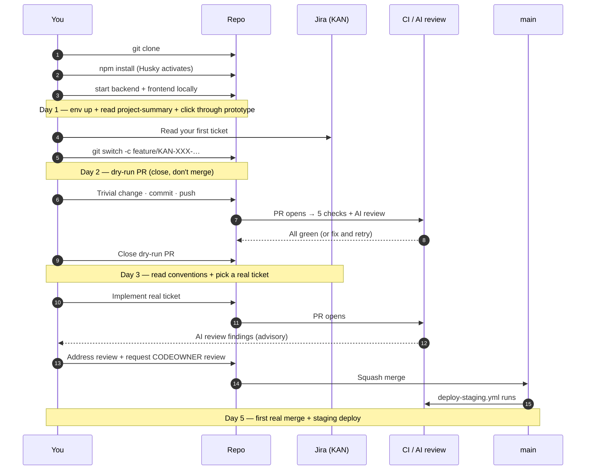

# Welcome to Fleet operations

You're joining the team that builds **Fleet operations** — a web application that gives logistics teams a single workspace to monitor vehicles, drivers, and trip data through a customizable 8 × 8 widget dashboard and a suite of eleven research-grade analytics tools. Fleet managers run their day on the Dashboard; data analysts and operations directors live in the Research workspace; HR and safety officers consume the driver-scoring and cohort views. We're building this for logistics teams who today live in spreadsheets and want a place to do real analysis without a data-platform team between them and the data.

By the end of this page you'll have the project running locally, opened a throwaway PR end-to-end, and seen where to look when something goes wrong.

## What you're walking into

The codebase has two top-level modules: `src/backend/` (TypeScript / NestJS, owns auth, multi-tenant queries, the SQL console, the export pipeline) and `src/frontend/` (TypeScript / React + Tailwind, owns the SPA — auth flows, the dashboard composer, the eleven research tools). Both modules have their own `package.json`; commands run from the workspace root via `npm run … --workspaces`. Tests are Vitest in both modules plus Playwright end-to-end against the running SPA.

The team includes a Tech Lead, a Backend Developer, a Frontend Developer, a DevOps Engineer, a UI/UX Designer, a Business Analyst, a QA Engineer, a Data Scientist, a Security Engineer, a DB Architect, and a Product Manager — eleven roles in total. Each role has its own study list and first-week plan in [`docs/roles/`](roles/). Read the one that matches your title first; the others are useful context, not required.

Live integrations on this repo:

- **Jira** project [KAN](https://maksymleb18.atlassian.net/browse/KAN) is the ticket tracker. Every branch, commit, and PR title carries a `KAN-\d+` prefix.
- **Confluence** space **SD** holds the wiki-side mirror of `docs/`. The four canonical pages — Project Overview, Requirements, Technologies, User Roles — are kept in sync on every `/configure` run.
- **GitHub MCP** + **Atlassian MCP** are both wired in to Claude Code so the AI commands (`/new-release`, `/finish-release`, `/edit-release`) can read tickets and create PRs without leaving the chat.
- **AI PR review** is enabled — Claude (Sonnet 4.6 via Bedrock) posts a sticky review comment on every PR. Treat it as advisory.

## What it looks like

Below are inline renders of all 17 product screens, captured from the interactive HTML prototype. The Screens table on [`docs/project-summary.md`](project-summary.md) has the same images with the linked requirement codes alongside. Open [`docs/requirements/fleet_mockup.html`](requirements/fleet_mockup.html) in a browser to interact with the live prototype — header toggles flip between signed-out and signed-in views; the demo-state buttons on the Dashboard cycle through Empty → Selecting → Configured; the Research sidebar walks every tool.

**Auth — three modes**

_Sign in mode. Work email + masked password, "Stay signed in" defaulted on, SSO row at the bottom (Google, Microsoft, Okta, generic SAML)._

_Create account mode. Live four-segment password strength meter, terms-of-service acceptance, only Google + Microsoft SSO (Okta / SAML are workspace-level)._

_SSO mode. Workspace slug, "Continue with SSO", and a "Recent organizations" list of previously-used workspaces with last-used relative time._

**Dashboard — three lifecycle states**

_Empty state. All 64 cells blank; status text invites the user to click-and-drag a region._

_Selecting state. A 4 × 3 selection is highlighted; the widget picker is open underneath. Each widget shows its minimum required region size._

_Configured state. Default layout with all nine widgets — Miles / Fuel / Issues / Drivers KPIs, the daily-miles trend line, fuel-by-vehicle bar comparison, driver leaderboard, issues feed, and utilization heatmap._

**Research workspace — eleven tools**

_Query builder — no-code ad-hoc analysis: dataset + date range + group-by + aggregate + stacked `where` filters + paginated preview._

_Pivot table — spreadsheet-style cross-tab with heat-shaded cells, row and column totals._

_Cohorts — triangular retention grid, future cells render as dashes._

_SQL console — dark editor with syntax highlighting. New workspaces start in sandbox mode (§8.4); production data needs admin promotion._

_Trend & forecast — Holt-Winters by default (§8.5), Prophet auto-suggested for metrics with weekly seasonality + holiday effects._

_Anomaly detection — z-score / IQR / seasonal decomposition; sensitivity low / medium / high; circled markers on the chart and a feed of investigations below._

_Driver scoring — composite of Safety / Efficiency / Punctuality / Vehicle care with adjustable weights (default 40/25/20/15). Adjusting weights recomputes scores live._

_Correlation matrix — Pearson or Spearman across fleet metrics; "Strongest relationships" panel surfaces the top correlations in plain English._

_Report builder — drag-and-drop block palette: title, KPI row, line chart, bar chart, table, issues list, text block, page break. Export as PDF, HTML email, or Slack message._

_Scheduled exports — daily / weekly / monthly / quarterly / on-trigger cadences; email / Slack / webhook delivery; exponential-backoff retry (3 attempts)._

_Saved views — reusable analyses with pinning and team / org-wide sharing. Explicit "Use as dashboard widget" promotion is required to surface in the dashboard picker (§8.6)._

## Your first day (≈ 30–60 min)

1.  **Clone the repo.** `git clone git@github.com:sidious18/ai-template-reference.git` — about 30 seconds. The repo's only a few MB right now; that grows once `/new-release` scaffolds the modules.
2.  **Install Node tooling.** This is a Node 20 + npm workspaces project; from the repo root: `npm install`. The `prepare` script wires up Husky so the commit / pre-push hooks fire on your first commit. Expect output ending with `husky - Git hooks installed`.
3.  **Install gitleaks** (optional but recommended) so the pre-commit secret scan actually runs:

        brew install gitleaks       # macOS
        # or: see https://github.com/gitleaks/gitleaks for Linux / Windows

    If you skip this, the pre-commit hook prints a yellow "gitleaks not installed; skipping secret scan." and lets the commit through — CI still scans on PR.

4.  **Run the app.** Right now `setup.sh` and `run.sh` don't exist yet — they'll be written by the first `/new-release`. Until then, the manual flow is:

        cd src/backend && npm run start:dev   # NestJS on :3000
        cd src/frontend && npm run dev        # Vite on :5173

    Open <http://localhost:5173> in your browser. You should see the signed-out auth screen identical to [`docs/images/ui/screens/01-sign-in.png`](images/ui/screens/01-sign-in.png). If you instead see a connection error, the backend isn't up — jump to [When something breaks](#when-something-breaks).

5.  **Open the codebase.** Glance at the two modules listed above. Don't try to read everything — find the entry point for your role (your role doc points at it). The Tech Lead, Backend Developer, Frontend Developer, and DB Architect role docs each name a specific file to read first.

## Your first week

> **Day 1.** Today is about getting the environment running and seeing the product end-to-end. Finish _Your first day_ above, then read [`docs/project-summary.md`](project-summary.md) and the role doc that matches what you'll be doing ([`docs/roles/{your-role}.md`](roles/)). Open [`docs/requirements/fleet_mockup.html`](requirements/fleet_mockup.html) in a browser and click through every screen so you have a mental map of the product surface. Don't write code yet — the goal is to know the lay of the land.

> **Day 2.** Read [`docs/gitflow.md`](gitflow.md) and dry-run the workflow. Create a throwaway branch from `main` (`feature/KAN-XXXX-onboarding-dry-run` with a real Jira ticket — the Tech Lead can hand you a no-op `chore` ticket for this), make a trivial change (a typo fix in this doc, a `// hi` comment in a source file), commit using Conventional Commits, push, open a PR. Watch the CI jobs pass (`lint`, `typecheck`, `test`, `build`, `pr-title-check`). Watch the AI PR review post a sticky comment. **Don't merge it** — close the PR and delete the branch. By the end of Day 2 you should know the gitflow without checking the doc.

> **Day 3.** Skim the per-language conventions doc [`docs/conventions/typescript.md`](conventions/typescript.md). Run the test suites locally — `npm run test --workspaces`. Read [`docs/code-review.md`](code-review.md). Pick the oldest open ticket in your role's area from [Jira KAN](https://maksymleb18.atlassian.net/browse/KAN); don't start it yet, just understand the acceptance criteria and ask the Tech Lead or your role-buddy any questions you have.

> **Day 4.** Start on that ticket. Aim for small — your first real PR should change ≤ 200 lines and ship one focused improvement. Open it as a Draft PR while you iterate; flip to Ready for Review when the CI is green and the AI reviewer's findings are addressed. Self-assess against [`docs/code-review.md`](code-review.md) before requesting review.

> **Day 5.** Merge your first PR. Watch the staging deploy fire (`deploy-staging.yml` on every merge to `main`). Read [`SECURITY.md`](../SECURITY.md) and [`CONTRIBUTING.md`](../CONTRIBUTING.md). Skim [`docs/requirements/fleet_operations_spec.md`](requirements/fleet_operations_spec.md) end-to-end now that you have hands-on context.

By the end of week one, you'll have:

- The project running locally on a fresh checkout.
- One real merged PR with a tracked ticket.
- A clear picture of which module owns which feature in the spec.
- Familiarity with the team's gitflow without needing the doc open.
- A working mental model of where to look in Jira and Confluence.

## Your first PR (a dry run)

Treat the dry-run PR as a way to feel the workflow before doing real work. Use a real ticket — ask the Tech Lead for a no-op `chore` (e.g. `KAN-XXX add my name to the contributors list`).

1.  **Branch.**

    git switch main
    git pull --ff-only
    git switch -c feature/KAN-XXX-onboarding-dry-run

2.  **Make a tiny change.** Add your name + role to a `CONTRIBUTORS.md` (create it if it doesn't exist yet). One line.
3.  **Commit.**

        git add CONTRIBUTORS.md
        git commit -m "chore: KAN-XXX add {Your Name} to contributors"

    The `commit-msg` hook validates the format; if it rejects, read the error and fix the message.

4.  **Push + open the PR.**

        git push -u origin feature/KAN-XXX-onboarding-dry-run
        gh pr create --fill --base main

    The PR template asks for Summary / Changes / Test Plan / Linked Ticket. Fill all four — the Test Plan can literally be "manual: ran `cat CONTRIBUTORS.md` to confirm the line is there." Linked Ticket: `Closes KAN-XXX`.

5.  **PR title.** Must match the regex — `chore: KAN-XXX add {Your Name} to contributors`. Anything else and `pr-title-check` fails.
6.  **Watch CI.** Five checks run: `lint`, `typecheck`, `test`, `build`, `pr-title-check`. The AI review posts after a minute. Watch all five go green before flipping to Ready for Review.
7.  **Close the PR.** Click Close (not Merge). Delete the branch. The point of the dry-run is to know the controls, not to ship the file.

## How to start a real ticket

1. Pick a ticket from [Jira KAN](https://maksymleb18.atlassian.net/browse/KAN) — Todo column, assigned to you (or grab one if unclaimed). Move it to **In Progress**.
2. Branch from `main` using `feature/KAN-{NUMBER}-{slug}`.
3. Commit using Conventional Commits + the `KAN-{NUMBER}` rule (e.g. `feat(dashboard): KAN-42 add empty-state CTA`).
4. Open the PR. CODEOWNERS is auto-assigned as reviewer (`docs/code-review.md` explains who owns what).
5. After merge, the Jira ticket moves to **Done** via the GitHub ↔ Jira integration (`Closes KAN-42` line in the PR body).
6. Watch `deploy-staging.yml` ship to staging. Production deploys when Release Please cuts the next tag.

## Local test commands

| Module                  | Command                                                                          |
| ----------------------- | -------------------------------------------------------------------------------- |
| backend                 | `npm run test --workspace src/backend`                                           |
| frontend                | `npm run test --workspace src/frontend`                                          |
| end-to-end (Playwright) | `npm run test:e2e --workspace src/frontend` (after `npm run build --workspaces`) |
| all unit tests at once  | `npm run test --workspaces --if-present`                                         |

## What's in this repo

| Path                                                           | What it is                                                                                                                                                                     |
| -------------------------------------------------------------- | ------------------------------------------------------------------------------------------------------------------------------------------------------------------------------ |
| `README.md`                                                    | Repo landing page — what the product is, the stack, where to read more.                                                                                                        |
| `docs/`                                                        | Human-facing docs. Project summary, gitflow, onboarding (this file), code review, conventions, role docs, preserved requirements, screen renders.                              |
| `docs/requirements/`                                           | The source product spec + interactive HTML mockup, copied verbatim from `ai-instructions/requirements/`.                                                                       |
| `docs/images/ui/screens/`                                      | 17 PNGs rendered from the prototype.                                                                                                                                           |
| `docs/confluence/`                                             | Local-docs copies of the four Confluence pages — only present in fallback mode. Currently disabled since the Atlassian MCP is live.                                            |
| `src/backend/`                                                 | NestJS API module. Will be scaffolded by `/new-release`.                                                                                                                       |
| `src/frontend/`                                                | React + Tailwind SPA module. Will be scaffolded by `/new-release`.                                                                                                             |
| `ai-instructions/`                                             | AI instruction pack — commands, role specs, guides, releases, the `configure.json` decision record. **You don't need to read this** unless you're customizing the AI workflow. |
| `ai-instructions/releases/init/project-summary.md`             | The AI-side mirror of `docs/project-summary.md` (kept in sync; `docs/` is canonical).                                                                                          |
| `.github/`                                                     | Issue forms, PR template, CODEOWNERS, Dependabot, all GitHub Actions workflows.                                                                                                |
| `.husky/`                                                      | Pre-commit, commit-msg, pre-push hooks. Activated by `npm install`.                                                                                                            |
| `commitlint.config.cjs`                                        | Conventional Commits + `KAN-{NUMBER}` rule.                                                                                                                                    |
| `.gitleaks.toml`                                               | Secret scan ruleset for pre-commit + CI.                                                                                                                                       |
| `release-please-config.json` + `.release-please-manifest.json` | Version + CHANGELOG automation.                                                                                                                                                |
| `package.json` (root)                                          | npm workspaces orchestration + Husky bootstrap. The per-module `package.json` files own real dependencies.                                                                     |

## Glossary

> **Workspace** — a single customer organization. The product is multi-tenant; data does not cross workspaces. Soft-deletable with 30-day retention.
>
> **Vehicle** — plate, make/model, status (active / in service / parked / retired), assigned driver, service history.
>
> **Driver** — name, hire date, license info, assigned vehicle, score components (Safety / Efficiency / Punctuality / Vehicle care).
>
> **Trip** — date, driver, vehicle, miles driven, fuel consumed, average speed, idle time, route.
>
> **Incident / issue** — vehicle or driver, severity (low / medium / high), status (open / acknowledged / resolved), days-open, description.
>
> **Schedule / shift** — driver assignments, time windows, regional coverage.
>
> **Region (Dashboard)** — a rectangular selection of cells on the 8 × 8 grid; widgets occupy regions, not individual cells.
>
> **Saved view** — a stored Research result (Query builder / Pivot table / SQL console / Anomaly / etc.) that can be re-opened, shared, pinned, and explicitly promoted to a dashboard widget.
>
> **Sandbox mode (SQL console)** — synthetic dataset (50 vehicles, 60 days of trips). Default for new workspaces; an admin must promote to production data, and once promoted, sandbox cannot be re-enabled.

## When something breaks

**`npm install` fails on a native dependency.** Usually a node-gyp issue — you're either on the wrong Node version or missing the system toolchain. Confirm Node 20.11+ (`node -v`). On macOS, `xcode-select --install` resolves most native build failures. On Linux, install `build-essential`.

**The frontend dev server starts but the page is blank.** The SPA probably can't reach the backend. Open the browser devtools Network tab and look for the first request to `/api`. If it's failing CORS or returning 404, the backend isn't running on `:3000` — `lsof -i :3000` shows what's using the port. Kill the stray process and re-start the backend.

**`npm run start:dev` (backend) fails with a database connection error.** Aurora isn't running locally — you need a local Postgres (Docker or Postgres.app). The first `/new-release` will add a `docker-compose.yml` that brings up Postgres + Redis; until then, a local install works fine. The env var the backend reads is `DATABASE_URL`.

**Tests pass locally but fail in CI.** The most common cause is timezone — the spec mandates UTC storage everywhere, so any test that compares dates needs to be timezone-explicit. CI runs in UTC; your machine probably doesn't. Wrap date-sensitive tests with `vi.setSystemTime(...)` or use `date-fns-tz` for explicit zones.

**Pre-commit hook rejects a commit.** Read the message. `commitlint` errors point at the exact rule that failed (missing ticket, wrong type, subject too long). `lint-staged` errors come from Prettier / ESLint — most are auto-fixable; just stage the formatted file and retry.

**The pre-push hook is slow.** It runs the full `lint + typecheck` across both workspaces — that's intentional, matches what CI does. If you've already run them and want to skip a known-good push, `git push --no-verify` is the escape hatch (use sparingly; CI still gates the merge).

If the fix isn't here, ask in [GitHub Issues](https://github.com/sidious18/ai-template-reference/issues) with the `question` tag, or in [Discussions](https://github.com/sidious18/ai-template-reference/discussions). This doc gets updated with new failure modes as we hit them.

## Where to ask

Open an issue tagged `question` on [sidious18/ai-template-reference](https://github.com/sidious18/ai-template-reference/issues), or start a thread in [Discussions](https://github.com/sidious18/ai-template-reference/discussions). The Tech Lead watches both. For sensitive questions (security disclosures, anything PII-adjacent), follow [SECURITY.md](../SECURITY.md) instead.

## Pointers to your role doc

If you're joining as a **Tech Lead**, [your role doc](roles/tech-lead.md) has the architecture-review study list and the "what to look at first" reading order.
If you're joining as a **Backend Developer**, [your role doc](roles/backend-developer.md) covers the NestJS module entry point and the live-tracker query for backend tickets.
If you're joining as a **Frontend Developer**, [your role doc](roles/frontend-developer.md) covers the React module, Tailwind setup, and accessibility expectations.
If you're joining as a **DevOps Engineer**, [your role doc](roles/devops-engineer.md) covers the AWS topology, CI workflows, and IAM/OIDC setup.
If you're joining as a **UI/UX Designer**, [your role doc](roles/ui-ux-designer.md) covers the design tokens, the mockup workflow, and which screens have open questions.
If you're joining as a **Business Analyst**, [your role doc](roles/business-analyst.md) covers the spec maintenance flow and how requirements get linked to tickets.
If you're joining as a **QA Engineer**, [your role doc](roles/qa-engineer.md) covers the Playwright e2e suite, the WCAG audit checklist, and the browser matrix.
If you're joining as a **Data Scientist**, [your role doc](roles/data-scientist.md) covers the analytics surface (Holt-Winters, anomaly detection, driver scoring, correlation) and the sandbox SQL dataset.
If you're joining as a **Security Engineer**, [your role doc](roles/security-engineer.md) covers the auth model, audit log, and rate-limit / cost-ceiling guardrails.
If you're joining as a **DB Architect**, [your role doc](roles/db-architect.md) covers the multi-tenant schema, soft-delete strategy, and the sandbox vs production data split.
If you're joining as a **Product Manager**, [your role doc](roles/product-manager.md) covers the v1 scope, v2 design-decision backlog, and the stakeholder review cadence.

## Architecture overview

The product is a single-page React app served from S3 behind CloudFront, talking to a NestJS API on EC2 + Auto Scaling Group, backed by Aurora Postgres and ElastiCache Redis. BullMQ runs on Redis for the scheduled-export and webhook-delivery queues. Secrets Manager holds the JWT signing keys, SAML certs, and Aurora credentials. Per-workspace data isolation is enforced at the API layer (every query is scoped to the current workspace's ID; the SQL console runs with a workspace-restricted role).

A full system-context diagram lives on the Confluence Project Overview page; a module / service diagram lives on Technologies. Both are auto-generated from `configure.json` on every `/configure` run, so re-read them rather than this paragraph when you need detail.

## Your first-week journey

If you ever get lost during the first week, this is the shape of what you're doing.
