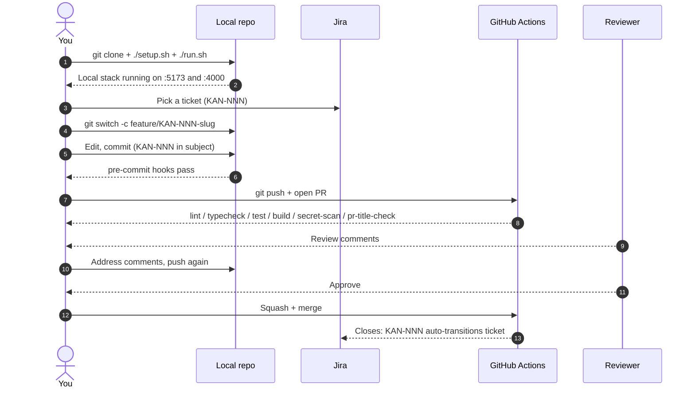

# Welcome to Fleet operations

You're joining a team building a multi-tenant SaaS web app that lets logistics and operations teams monitor their fleet — vehicles, drivers, trips, and incidents — through a customizable 8×8 tile dashboard and a workspace of 11 analytical tools (query builder, pivot, cohorts, SQL console, trend & forecast, anomaly detection, driver scoring, correlation, report builder, scheduled exports, saved views). Each customer organization signs in to its own workspace at `{workspace}.fleetops.app`. By the end of this page you'll have the project running locally, opened a throwaway PR end-to-end, and know exactly where to look when something goes wrong.

## What you're walking into

The team includes Backend Developers, Frontend Developers, a UI/UX Designer, a Business Analyst, a Tech Lead, a QA Engineer, a DevOps Engineer, a Security Engineer, a Data Engineer, and a Product Manager. Your role's day-by-day plan and study list live in [`docs/roles/`](roles/) — read the file that matches your title after you've finished this page.

The codebase is two independent modules:

- **`backend`** (`src/backend/`) — TypeScript on Node 22 + Express. Owns auth, sessions, the REST API, BullMQ workers, ClickHouse and Postgres access.
- **`frontend`** (`src/frontend/`) — React + TypeScript + CSS Modules. Owns every pixel the user sees in the browser.

Each module has its own `package.json`, its own tests, and its own deploy pipeline. They communicate over HTTPS — there is no shared in-process boundary.

The integrations you'll touch on day one:

- **Jira** (project [`KAN`](https://maksymleb18.atlassian.net/jira/software/projects/KAN/boards)) — every ticket, branch, and PR carries a `KAN-NNN` reference. Branch names, commit subjects, and PR titles enforce the key locally and in CI.
- **Confluence** (space `SD` — *Software Development*) — Project Overview, Requirements, Technologies, and User Roles pages. The pages stay in sync with `docs/` and `ai-instructions/configure.json` on every `/configure` re-run.
- **GitHub** (`sidious18/ai-template-reference`) — the home of the code, CI, branch protection, the AI PR-review workflow, and Discussions for questions.

## What it looks like

There's an interactive prototype that walks through every screen and state — open [`docs/requirements/fleet_mockup.html`](requirements/fleet_mockup.html) in any modern browser. The mockup is a single self-contained file: three top-level views (signed-out auth screen, signed-in dashboard, research workspace), three dashboard demo-states (empty / selecting / configured), and eleven research tools accessible from the sidebar. There are no inline previews here because no static renders were produced — install Playwright and re-run `/configure` if you want per-screen PNGs embedded in this doc.

## Your first day (≈ 30–60 min)

1. **Clone the repo.** `git clone git@github.com:sidious18/ai-template-reference.git` — about 30 seconds with a warm key.
2. **Run setup.** `./setup.sh` will install Node 22, the backend and frontend npm deps, the pre-commit framework, and pull the local Docker images for Postgres, ClickHouse, and Redis. The setup script does not exist yet — it gets written by the first `/new-release`. Until then, the fall-back is:

   ```sh
   pipx install pre-commit && pre-commit install --install-hooks
   ( cd src/backend  && npm ci )
   ( cd src/frontend && npm ci )
   docker compose up -d   # once /new-release writes docker-compose.yml
   ```

3. **Run the app.** `./run.sh` boots the dependencies, starts the backend on `http://localhost:4000`, and starts the Vite dev server for the frontend on `http://localhost:5173`. Open `http://localhost:5173` in Chrome. You should see the sign-in screen from the prototype; the demo-state buttons in the top toolbar let you flip through Empty / Selecting / Configured without writing any data.
4. **Open the codebase.** Glance at the two modules. Don't try to read everything — find the entry point for your role (your role doc points at it).

When `setup.sh` / `run.sh` don't exist yet, the manual fall-back above is exactly what they'll do once written.

## Your first week

**Day 1.** Today is about getting the environment running and seeing the product end-to-end. Finish the steps above, then read [`docs/project-summary.md`](project-summary.md) and the role doc that matches what you'll be doing ([`docs/roles/{role}.md`](roles/)). Don't write code yet; the goal is to know the lay of the land.

**Day 2.** Open the spec ([`docs/requirements/fleet_operations_spec.md`](requirements/fleet_operations_spec.md)) and the interactive prototype side by side. Trace one feature — pick something in your role's lane — from the spec text into the prototype, then into wherever it would live in `src/backend/` or `src/frontend/`. You won't write code, but you should be able to say "here is where this lives" by lunchtime.

**Day 3.** Do the *Your first PR* dry-run below. It's a throwaway exercise that walks the whole pipeline (branch → commit → CI → review) without merging anything. By the end you'll know how the hooks reject malformed commits, what the PR template looks like, and what the AI review surfaces.

**Day 4.** Pick the smallest real ticket in your role's Jira component. Branch, write the change, open a real PR. Expect a round of feedback — that's the point. Aim to merge by end of day.

**Day 5.** Read [`docs/gitflow.md`](gitflow.md) and [`docs/code-review.md`](code-review.md) end-to-end. Then look at the most recent five merged PRs to see how reviewers actually behave in this repo — the docs describe rules, the merged PRs show culture.

By the end of week one, you'll have:

- The app running locally, with all three top-level screens working.
- Opened at least one merged PR through the full pipeline.
- Read the spec, the project summary, and your role doc.
- A working mental model of which module owns which feature.

## Your first PR (a dry run)

Walk through the workflow with a tiny, throwaway change — add a comment somewhere, or fix a typo. Goal: feel the hooks, the CI, the PR template, and the AI review **before** doing real work.

1. **Branch.** Pick (or create) a Jira ticket for "Onboarding dry run" and grab its key — say `KAN-401`.

   ```sh
   git switch main && git pull --rebase origin main
   git switch -c feature/KAN-401-onboarding-dry-run
   ```

2. **Make a tiny change** somewhere innocuous (a comment in `README.md`, your name in a placeholder).

3. **Commit using the convention.** This will be rejected by the `commit-msg` hook if you forget the `KAN-N`:

   ```sh
   git add -p
   git commit -m "docs: KAN-401 add my name to onboarding placeholder"
   ```

4. **Push and open a PR.**

   ```sh
   git push -u origin feature/KAN-401-onboarding-dry-run
   gh pr create --base main \
     --title "docs: KAN-401 add my name to onboarding placeholder" \
     --body '## Summary
   Onboarding dry-run. Throwaway PR — close without merging.

   ## Changes
   - Replaced a placeholder name in `README.md`.

   ## Test Plan
   - None required (docs only).

   ## Linked Ticket
   Closes: KAN-401'
   ```

5. **Watch the checks fire** in the PR. Confirm CI is green, see what the AI review says, and read how CODEOWNERS auto-assigned reviewers. Then **close** the PR without merging — this exercise produced nothing the team needs to ship.

## How to start a real ticket

1. Pick a ticket in [Jira project KAN](https://maksymleb18.atlassian.net/jira/software/projects/KAN/boards). Move it to *In Progress*, self-assign.
2. Branch from `main` using `feature/KAN-{N}-{slug}`.
3. Commit using `<type>: KAN-{N} <summary>` — see [`docs/gitflow.md`](gitflow.md) for the allowed types.
4. Push and open a PR. The title must match the commit shape (the `pr-title-check` workflow enforces it). Fill in all four PR template sections.
5. Resolve every review conversation, get one approval, watch CI go green, then squash-merge.

## Local test commands

- **`backend`** — `( cd src/backend && npm test )` — vitest + supertest against an in-memory Postgres and ClickHouse stub.
- **`frontend`** — `( cd src/frontend && npm test )` — vitest + React Testing Library.
- **End-to-end** — `( cd src/frontend && npm run test:e2e )` — Playwright against the running stack on `localhost:5173`.

All tests at once (once `setup.sh` / `run.sh` exist): `./run.sh test`.

## What's in this repo

| Path | What it is |
|---|---|
| `ai-instructions/` | The AI pack — `configure.json`, requirements bundle, bootstrap templates, role thinking-modes. You almost never need to read this directory unless you're working on the AI workflow itself. |
| `ai-instructions/configure.json` | The decision record. Everything `/bootstrap` and the release commands key off lives here. |
| `ai-instructions/requirements/` | The original spec + mockup as delivered. Treat as read-only history. |
| `docs/` | Human-facing docs — this file, gitflow, code review, security, contributing, role docs, conventions, source requirements. |
| `docs/requirements/` | Preserved spec + interactive prototype, with image references rewritten to repo-relative paths. |
| `src/backend/` | Node + Express + TypeScript API. |
| `src/frontend/` | React + TypeScript + CSS Modules client. |
| `.github/` | CI workflows, issue + PR templates, CODEOWNERS, dependabot. |
| `.pre-commit-config.yaml` | Local hooks — prettier, eslint, gitleaks, commit-msg KAN-N enforcement, pre-push lint + typecheck. |
| `README.md` | Repo landing page; one-paragraph product summary plus a doc index. |
| `CLAUDE.md` | AI-pack entry point written by `/bootstrap`. Tells AI tools how to behave in this repo. |
| `ai-plugins.json` | AI-pack manifest written by `/bootstrap` — modules, roles, guides, settings. |

## Glossary

The vocabulary that shows up everywhere in the codebase. Use it consistently in commit messages, ticket descriptions, and PR bodies.

> **Workspace** — a single customer organization. The product is multi-tenant; data does not cross workspaces. Each workspace owns its own users, layouts, schedules, audit log, and SQL-console sandbox/production toggle.
>
> **Vehicle** — a unit in the fleet. Has a plate, make/model, status (active / in service / parked / retired), an assigned driver, and a service history.
>
> **Driver** — a person who operates one or more vehicles. Has a name, hire date, license info, an assigned vehicle, and a composite score built from safety, efficiency, punctuality, and vehicle-care sub-metrics.
>
> **Trip** — a single journey by one driver in one vehicle. Carries date, miles driven, fuel consumed, average speed, idle time, and route.
>
> **Incident** (also called **issue**) — a vehicle- or driver-related problem with a severity (low / medium / high) and a status (open / acknowledged / resolved).
>
> **Schedule / shift** — a driver's assignment to a vehicle or region across a time window.
>
> **Layout** — a saved arrangement of widgets on the 8×8 dashboard grid. Each workspace can have multiple named layouts (e.g., "Fleet overview", "Driver focus", "Cost analysis").
>
> **Widget** — one of the nine catalog visualizations the user can place on the grid. Each widget has a minimum region size (e.g., Trend line needs 3 × 2).
>
> **Saved view** — a reusable analysis stored in the Research workspace's library. Can be shared per-team or org-wide and, after explicit *promotion*, can be used as a custom dashboard widget.
>
> **Sandbox mode** — a new workspace's SQL console runs against a synthetic dataset by default. An admin must explicitly promote a workspace to production data; promotion is irreversible.
>
> **In-app roles** — Admin / Analyst / Manager / Viewer. These are *application* roles (the people using the SaaS), not the *team* roles (the people building it).

## When something breaks

**`./setup.sh` fails on a missing system dependency.** The script needs Node 22, npm 10+, Docker, and `pipx`. The most common gap on a fresh Mac is Docker — make sure Docker Desktop is running before re-running setup. On Linux, `brew install node@22 pipx` (Linuxbrew) or use `nvm`.

**`./run.sh` can't bind a port.** Something else is using 4000 (backend) or 5173 (frontend), or you've already got the stack running in another shell. Find it with `lsof -i :4000` and stop it, or set `PORT=4001 ./run.sh`.

**Tests pass locally but fail in CI.** First check: did you commit your `.env.example` updates but not the new env var in CI? Look at the CI logs for "missing env var" near the failing step. Second: Playwright differs between Mac and Linux on font rendering — re-run with `PLAYWRIGHT_BROWSERS_PATH=0 npm run test:e2e` if a visual snapshot fails locally.

**Pre-commit hook rejects a commit.** Read the actual error — it's almost always (a) a Prettier or ESLint complaint you can fix with `npm run lint:fix` in the affected module, (b) a missing `KAN-NNN` in the commit subject, or (c) gitleaks flagging a real-looking secret in your diff. If it's (c) and you're sure it's a false positive, add an entry to `.gitleaks.toml`'s allowlist (and tell the Security Engineer).

**`docker compose up` doesn't see ClickHouse.** The image takes ~30 s to initialize the system database on first run. `docker compose logs clickhouse` while it boots — wait for `Ready for connections`.

If the fix isn't here, ask in **GitHub Discussions** (see *Where to ask* below). This doc gets updated with new failure modes as we hit them.

## Where to ask

Open a new discussion on **[GitHub Discussions](https://github.com/sidious18/ai-template-reference/discussions)** and tag your post `onboarding`. The team watches the repo, and answered threads stay searchable for the next hire. For sensitive issues (security vulnerabilities, anything involving customer data), email the Security Engineer directly — see `SECURITY.md` for the contact and the disclosure policy.

## Pointers to your role doc

The first thing to read after this page is the role doc that matches your title — it has a study list and a day-by-day plan tailored to your work:

- Joining as a **Backend Developer**? [`docs/roles/backend-developer.md`](roles/backend-developer.md) — owns `src/backend/`, the Express API, the BullMQ workers, and the Postgres + ClickHouse data layer.
- **Frontend Developer**? [`docs/roles/frontend-developer.md`](roles/frontend-developer.md) — owns `src/frontend/`, the React app, the dashboard widget catalog, and the research-tool UIs.
- **UI/UX Designer**? [`docs/roles/ui-ux-designer.md`](roles/ui-ux-designer.md) — owns the design tokens, the interactive prototype, the screen library.
- **Business Analyst**? [`docs/roles/business-analyst.md`](roles/business-analyst.md) — owns the spec, acceptance criteria, and stakeholder alignment.
- **Tech Lead**? [`docs/roles/tech-lead.md`](roles/tech-lead.md) — owns `ai-plugins.json`, CI workflows, architecture decisions, the configuration pipeline.
- **QA Engineer**? [`docs/roles/qa-engineer.md`](roles/qa-engineer.md) — owns end-to-end tests, regression checklists, perf-target verification.
- **DevOps Engineer**? [`docs/roles/devops-engineer.md`](roles/devops-engineer.md) — owns Vercel + Render deploy, secrets, dependencies, CI runtime.
- **Security Engineer**? [`docs/roles/security-engineer.md`](roles/security-engineer.md) — owns auth flows, PII handling, audit log, threat model, gitleaks rules.
- **Data Engineer**? [`docs/roles/data-engineer.md`](roles/data-engineer.md) — owns the ClickHouse schema, the seasonality detector, the sandbox dataset fixtures.
- **Product Manager**? [`docs/roles/product-manager.md`](roles/product-manager.md) — owns roadmap, KPIs, the design-decision log.

## Your first-week journey



If you ever get lost during the first week, this is the shape of what you're doing.
